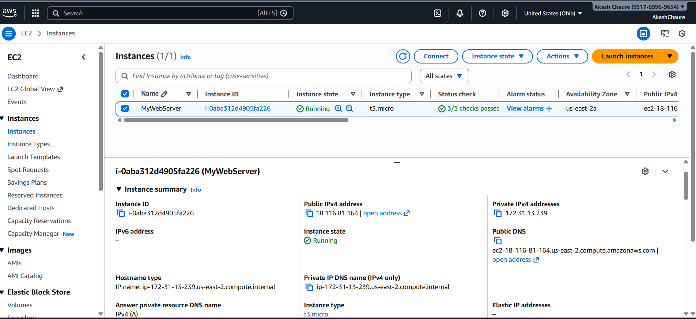
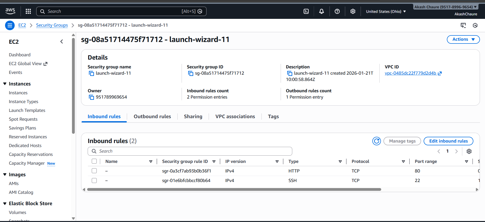
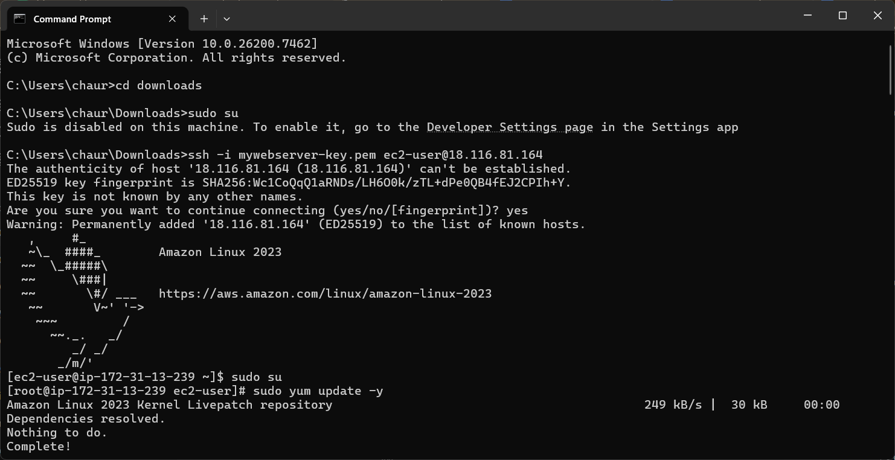
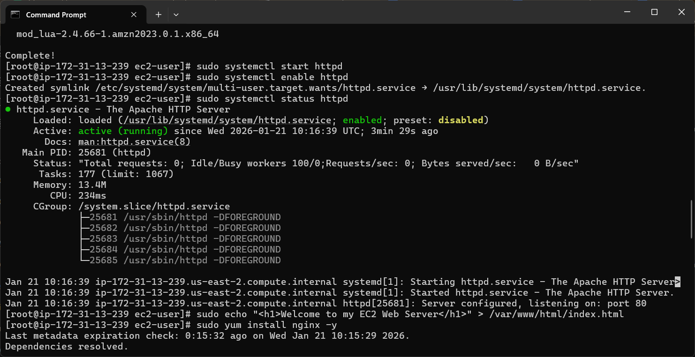
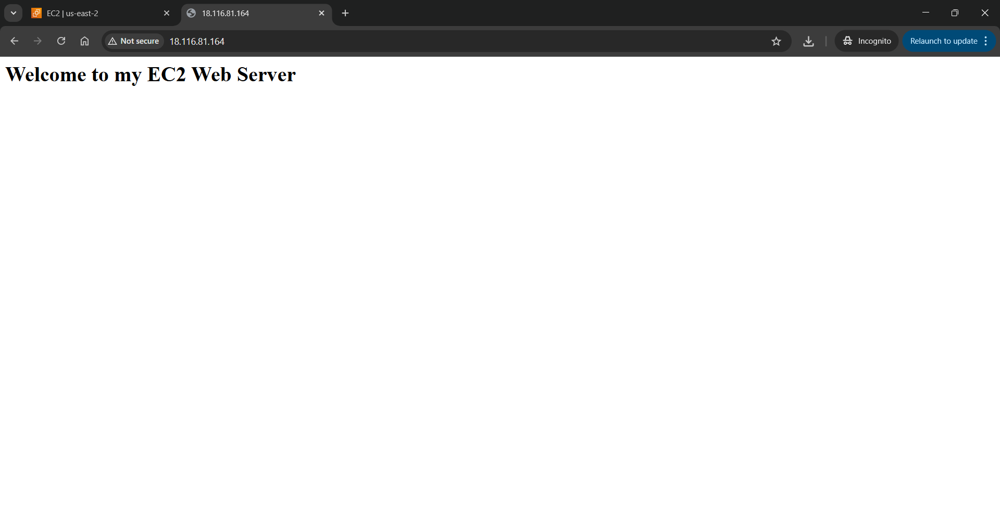

EC2 Apache / Nginx Web Server Deployment on AWS
📌 Project Overview

This project demonstrates how to deploy a web server on Amazon EC2 using Apache HTTP Server (httpd) or Nginx.
The goal is to understand key AWS infrastructure concepts such as EC2 provisioning, security groups, SSH access, and Linux server management while hosting a static website accessible over the internet.

🌍 Live Demo

🔗 Website URL:

http://18.116.81.164

(Replace this IP if your instance changes)

🏗️ Architecture Overview

Compute: Amazon EC2 (t3.micro – Free Tier eligible)

Operating System: Amazon Linux

Web Server: Apache HTTP Server (httpd) / Nginx

Protocol: HTTP (Port 80)

Remote Access: SSH (Port 22)

The EC2 instance acts as a virtual server where a web server is installed and configured to serve a static HTML page using the instance’s public IPv4 address.

🛠️ Tech Stack

AWS EC2

Amazon Linux

Apache (httpd) / Nginx

SSH & Linux CLI

Git & GitHub

📁 Repository Structure
ec2-apache-web-server/
├── index.html
├── README.md
├── setup-commands.txt
└── screenshots/

⭐ Key Features

EC2 instance provisioning

Secure SSH access using key pairs

Apache/Nginx web server setup

Static website hosting

Security Group configuration (HTTP & SSH)

Auto-start configuration on reboot

🚀 Step-by-Step Deployment Guide
1. Launch an EC2 Instance

Created an EC2 instance using Amazon Linux AMI

Selected instance type: t3.micro (Free Tier eligible)

Created and downloaded a key pair

Configured Security Group to allow:

SSH → Port 22

HTTP → Port 80

2. Connect to EC2 via SSH
ssh -i your-key.pem ec2-user@18.116.81.164

3. Install Apache Web Server
sudo yum update -y
sudo yum install httpd -y
sudo systemctl start httpd
sudo systemctl enable httpd
sudo systemctl status httpd

Expected output:

active (running)

4. Deploy Website Content
sudo echo "<h1>Welcome to My EC2 Web Server</h1>" > /var/www/html/index.html

5. Access Website

Open browser:

http://18.116.81.164

The page displays the custom welcome message, confirming the server is working.

🔐 Security Configuration

AWS Security Group allows inbound HTTP (80) and SSH (22)

IAM and EC2 key pairs ensure secure authentication

Public access limited to required ports only

✅ Verification Checklist

EC2 instance state: Running

Apache service status: Active (running)

Port 80 allowed in inbound rules

Website accessible via browser using public IP

📸 Project Screenshots
### EC2 Instance Running

### Security Group Inbound Rules

### SSH Connection to EC2

### Apache Service Status

### Website Output

📚 Learning Outcomes

Real-world AWS EC2 deployment

Linux web server administration

Git & GitHub version control

Cloud networking & security fundamentals

🌍 Real-World Use Cases

Hosting static websites

Deploying backend services

Reverse proxy configuration

Entry-level DevOps infrastructure projects

🎯 Interview-Ready Summary

I deployed a public web server on AWS EC2 by configuring security groups, installing Apache/Nginx, hosting a static webpage, and ensuring service persistence across reboots. This project demonstrates cloud infrastructure provisioning, Linux system management, and production-ready deployment skills.

🔮 Future Enhancements

Assign Elastic IP

Add custom domain using Route 53

Enable HTTPS using SSL/TLS

Configure Load Balancer

Automate deployment with User Data / Shell Script

👩‍💻 Author

Jaishree Chaure